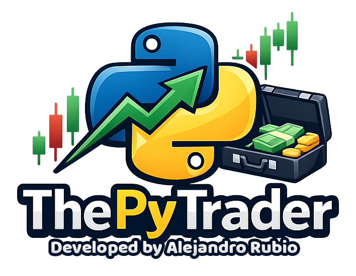

# ThePyTrader 🚀





**ThePyTrader** es una herramienta en Python para calcular y analizar una cartera de inversión a partir de movimientos de **compras y ventas**, enriquecer la información con **tickers**, obtener **precios actualizados**, calcular **rendimiento y ganancia**, y finalmente **persistir las posiciones abiertas en una base de datos**.

---

## ✨ Funcionalidad principal

El flujo de ejecución del proyecto es el siguiente:

1. Carga de datos de compras
2. Carga de datos de ventas
3. Cálculo de posiciones abiertas
4. Resumen de cartera por acción
5. Asignación de tickers desde un JSON
6. Obtención de precios actuales
7. Cálculo de rendimiento y ganancia
8. Impresión de resultados
9. Inserción de posiciones abiertas en base de datos

---

## 🧱 Estructura del proyecto

```
.
├── main.py
├── integrations/
│   └── investing_scrapper.py
├── services/
│   ├── wallet_manager.py
│   └── price_manager.py
├── utils/
│   └── file_utils.py
└── datasets/
    └── investing_urls/
        └── default.csv
```

---

## ⚙️ Requisitos

- Python 3.10 o superior
- Conexión a internet para obtención de precios
- Dependencias listadas en `requirements.txt`

Dependencias comunes:
- pandas
- numpy
- yfinance (si se usa como fuente de precios)
- requests / beautifulsoup4 (si se usa scraping)
- driver de base de datos correspondiente

---

## ▶️ Uso

Ejecutar el script principal:

```bash
python main.py
```

El script mostrará un resumen de la cartera y almacenará las posiciones abiertas en la base de datos configurada.

-----

## 🏷️ Tickers

Los tickers se asignan mediante un archivo JSON que mapea nombres de acciones a tickers.

Ejemplo:

```json
{
  "Diageo": "DEO",
  "BATS": "BTI"
}
```

---

## 💸 Precios de mercado

El proyecto puede obtener precios desde:
- Scraping de Investing
- APIs como yfinance

---

## 🧮 Rendimiento

Se calcula por acción:
- Precio medio de compra
- Precio actual
- Ganancia absoluta
- Rendimiento porcentual

Se pueden excluir acciones manualmente antes del cálculo final.

---

## 🗄️ Base de datos

Dentro de la carpeta database están los ficheros SQL con las tablas requeridas para almacenar los datos en BD:

Tablas base:
- acciones_compras
- acciones_ventas
- posiciones_abiertas


---

## 📄 Licencia

Define aquí la licencia del proyecto.
